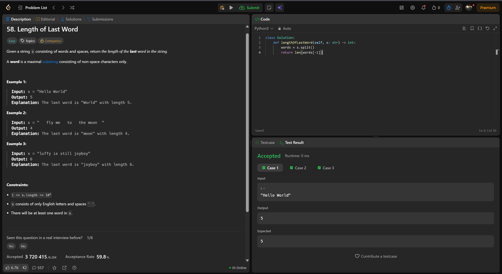
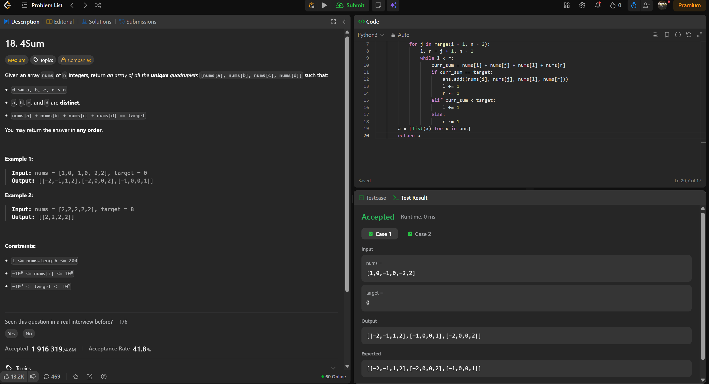
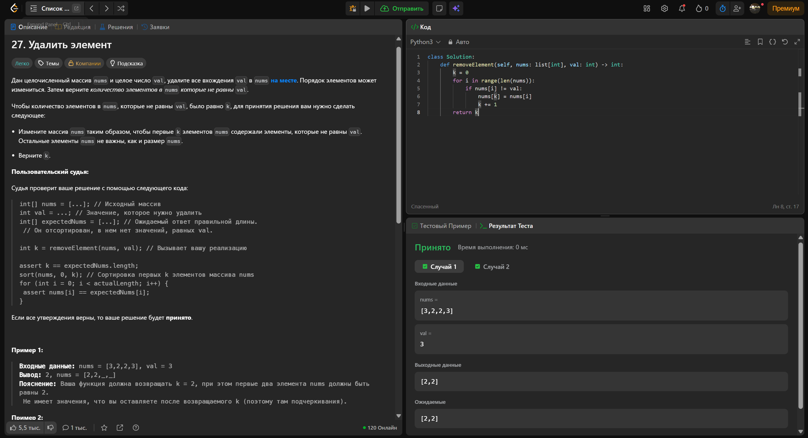

# LeetCode Solutions

Репозиторий содержит решения задач с платформы **LeetCode**, выполненные на языке **Python**.

Основная цель проекта — практика алгоритмов и структур данных, а также развитие навыков решения задач и написания чистого кода.

## Решённые задачи

| № | Название | Сложность | Тема |
|---|---|---|---|
| 58 | [Length of Last Word](https://leetcode.com/problems/length-of-last-word/) | Easy | String |
| 18 | [4Sum](https://leetcode.com/problems/4sum/) | Medium | Array, Two Pointers, Sorting |
| 27 | [Remove Element](https://leetcode.com/problems/remove-element/) | Easy | Array, Two Pointers |

## 🔗 Структура проекта

```text
python_course/
│
├── problems/
│   ├── 18_4sum.py
│   ├── 27_remove_element.py
│   └── 58_length_of_last_word.py
│
├── screenshots/
│   ├── task18.jpg
│   ├── task27.jpg
│   └── task58.jpg
│
├── .gitignore
├── .pre-commit-config.yaml
├── pyproject.toml
└── README.md
```

**`problems/`**
Содержит решения задач LeetCode. Каждый файл соответствует отдельной задаче.

**`screenshots/`**
Содержит скриншоты успешного прохождения задач на LeetCode.

## Решения задач

### 58 — Length of Last Word

**Сложность:** Easy

**Описание:**
Дана строка `s`, состоящая из слов и пробелов. Необходимо вернуть длину последнего слова в строке.

**Основная идея:** строковые методы.
В решении используется метод `.split()`, который разбивает строку на список слов `words`. Затем функция возвращает длину последнего элемента списка с помощью `len(words[-1])`. Данное решение успешно проходит тесты с временем выполнения 0 мс.

**Код (Python 3):**
```python
class Solution:
    def lengthOfLastWord(self, s: str) -> int:
        words = s.split()
        return len(words[-1])
```

Файл решения:
```text
problems/58_length_of_last_word.py
```

Скриншот успешного прохождения:


---

### 18 — 4Sum

**Сложность:** Medium

**Описание:**
Дан массив из `n` целых чисел `nums` и целевое значение `target`. Необходимо найти все уникальные четвёрки элементов, сумма которых равна `target`.

**Основная идея:** два указателя и автоматическое удаление дубликатов.
Решение использует множество `ans = set()` для исключения дубликатов кортежей. Внутри вложенных циклов применяется метод двух указателей `l` и `r`, которые сдвигаются навстречу друг другу (`while l < r`) в зависимости от суммы `curr_sum`. Итоговый результат конвертируется в формат `[list(x) for x in ans]`. Код показал отличный результат с временем выполнения 0 мс.

**Код (Python 3):**
```python
class Solution:
    def fourSum(self, nums: list[int], target: int) -> list[list[int]]:
        nums.sort()
        ans = set()
        n = len(nums)
        for i in range(n - 3):
            for j in range(i + 1, n - 2):
                l, r = j + 1, n - 1
                while l < r:
                    curr_sum = nums[i] + nums[j] + nums[l] + nums[r]
                    if curr_sum == target:
                        ans.add((nums[i], nums[j], nums[l], nums[r]))
                        l += 1
                        r -= 1
                    elif curr_sum < target:
                        l += 1
                    else:
                        r -= 1
        return [list(x) for x in ans]
```

Файл решения:
```text
problems/18_4sum.py
```

Скриншот успешного прохождения:


---

### 27 — Remove Element

**Сложность:** Легко (Easy)

**Описание:**
Дан целочисленный массив `nums` и целое число `val`. Необходимо удалить все вхождения `val` на месте и вернуть новое количество элементов `k`.

**Основная идея:** два указателя (in-place замена).
Переменная `k` инициализируется нулём и служит указателем для записи. Цикл `for i in range(len(nums))` перебирает массив, и если `nums[i] != val`, значение перезаписывается в позицию `nums[k]`, после чего `k` увеличивается на 1. Решение принято судьей с временем выполнения 0 мс.

**Код (Python 3):**
```python
class Solution:
    def removeElement(self, nums: list[int], val: int) -> int:
        k = 0
        for i in range(len(nums)):
            if nums[i] != val:
                nums[k] = nums[i]
                k += 1
        return k
```

Файл решения:
```text
problems/27_remove_element.py
```

Скриншот успешного прохождения:


---

## 🛠 Используемые технологии

* **Python 3.13** — язык программирования
* **Git** — система контроля версий
* **GitHub** — хранение и публикация репозитория
* **Ruff** — линтер и форматтер Python-кода
* **pre-commit** — автоматический запуск проверок перед commit

## 🚀 Проверка

Установить зависимости:
```bash
python3 -m pip install ruff pre-commit
```

Установить pre-commit hooks:
```bash
pre-commit install
```

Запустить проверки для всего репозитория:
```bash
pre-commit run --all-files
```

Используются следующие проверки:
* `ruff-check` — проверка кода;
* `ruff-format` — проверка форматирования.

Пример успешного выполнения:
```text
ruff-check.......................................................Passed
ruff-format......................................................Passed
```